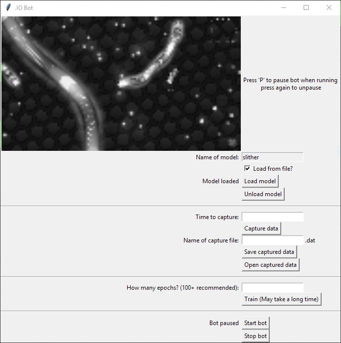

# deep--slither-io
deep learning bot designed to play almost any '.io' online game based on the actions of a human player

## How to install
clone the repo and run `GUI.py`

# How to use
## Geting weights
You can name the model with characters a-z eg `slither`. If you want to initialise a new set of weights, leave `Load from file?` unchecked. However, if you have previously made a model with the same name, you can load those weights instead by checking that box. 
Once you have sorted that out, you can press `Load model` to actually load those weights. If for any reason you want to change model, first press `Unload model` and then you may change it and load another. Your model well be automatically saved when it is first loaded and after training has finished.
## Capturing data for training
In order to train our model, we first need to collect data to train it on. During the capture 3 things will be recorded:

1. Mouse direction relative to the centre of the screen
2. Space key is down or not - most of these .io online games have an extra function other then 1. (silther - boost, brutal - detach flail, etc). These are usually done by mouse click, but tracking these requires more code and that is not the aim, so most games will also accept space instead so it should be fine.
3. What is displayed - this is resized down to 1280x72 and is recorded on your main monitor if you have multiple monitors. It is recommended that you put your browser in full screen mode (F11)

You must specify the amount of time to capture in seconds. Before the actual capture starts, there is a 10-second countdown to give the user enough time to get the game ready. Press `Capture data` to start the countdown, then you must play the game to the best of your ability and making sure to **use space bar instead of mouse click**. Once the capturing has finished, all the data will be written to some variables and capturing again will overwrite all of the previous data.
## Training
For those that do not know much about ML, this is the bit where we use a technique called gradient descent to alter the weights of the model in such a way that we can theoretically predict what the human (who was playing the game when the data was being captured) would do in a given situation in the game.

It is recommended that you have at least 100 epochs for the first training session but afterwards it really just depends.
## Running
In order to start the bot, press `Start bot` after this your mouse will be controlled by the bot. Due to it's nature, in order to stop it, you must first hold `P` until it gets paused and then press `Stop bot`. You may press `P` again in order to unpause the bot.

## Performance
Depending on your training data, it usually likes to go straight into a big snake in slither. This should be combated by going near big snakes and swerving away. I have observed it boosting in front of another snake, which proves that it has an intellegence of some sort. However, it did not go back and eat the food, which may indicate some problem with the architecture, which btw is probably those pooling layers which stop it from knowing where things are.
